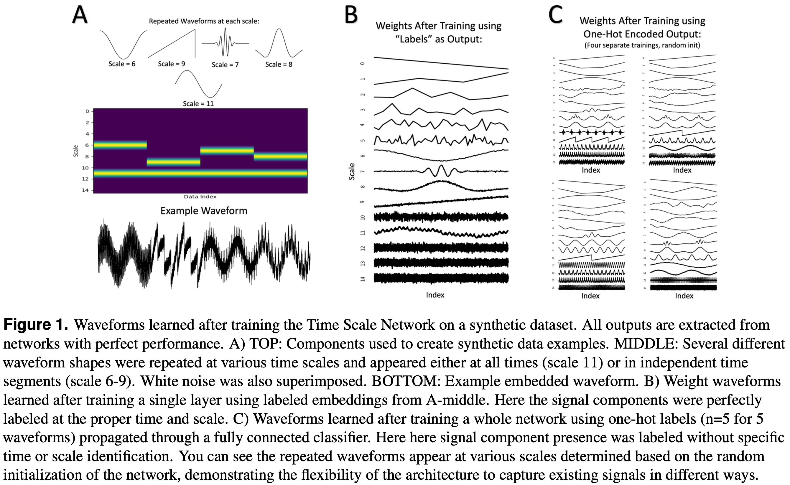

# Time Scale Network

## Examples

This folder contains basic examples demonstrating the use of the Time Scale Network (TiSc Net) on synthetic data. The goal is to demonstrate expected usage, and illustrate dimensions calculations as a reference for those using TiSc Net in new applications. See `simple.py` for extended descriptions.

First, some relevant notes and reminders:
* If incorporating multichannel data, how it is flattened is critically important to assure data from each channel is interleaved, mantaining the sequential time. You may need to transpose your data before reshaping (PyTorch), or change the flattening order (Numpy).
* Many of these examples visualize weights and output waveforms to verify success, using the `SGD` optimizer to better tune these time-domain outputs. However, if pursuing a classification objective it is recommended to use `RMSprop` or `ADAM` optimizers. In our testing, `ADAM` resulted slightly higher accuracies while `RMSprop` resulted in slightly smoother weight waveforms. Overall both were comparable.
* Similarly, while MSEloss is used in the examples, for classification Cross-Entropy or Binary-Cross-Entropy may work better.

Example scripts training individual layers or full networks can be found in the `trainLayer` and `trainNetwork` folders. Each of these networks require synthetic data to train, which can be generated by running `generateData.py` in the desired folder. The synthetic data and learned filters should roughly match the following figure:

